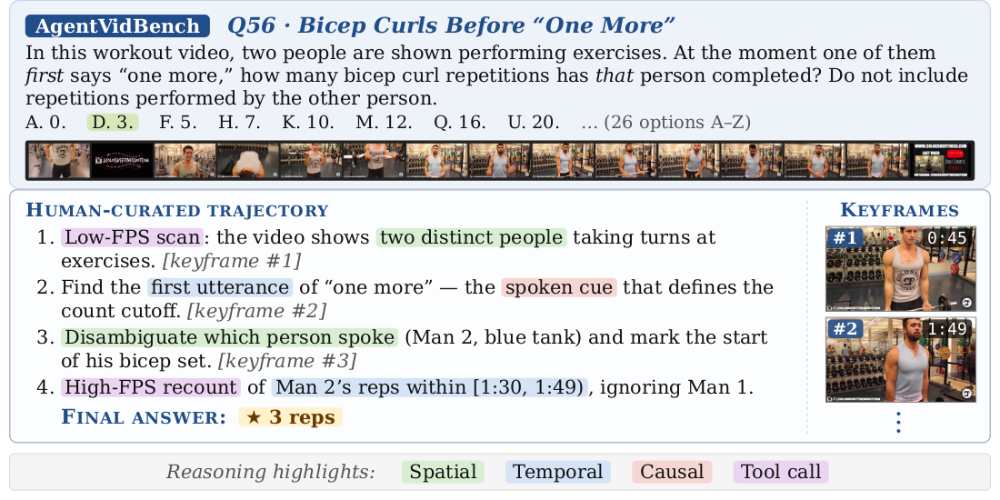

# AgentVidBench: A Multi-Hop Video Question Answering Benchmark for Evaluating MLLM Agents

<div align="center">

[](https://arxiv.org/abs/xxxx.xxxxx)
[](https://huggingface.co/datasets/AgentVidBench123/agentvidbench)

</div>

Agentic Video Understanding Benchmark — 100 multiple-choice video QA questions, 26 options each (A-Z; ~3.8% random baseline). Two evaluation frameworks, one entry point (`inference.py`):

<div align="center">
  
</div>

## 1. Installation

System requirement: **ffmpeg** on `PATH` (used by `singleturn` to sample frames). On Debian/Ubuntu: `sudo apt install ffmpeg`; on macOS: `brew install ffmpeg`.

```bash
# download and unzip this repository, then:
cd agentvidbench

conda create -n agentvideobench python=3.12 -y
conda activate agentvideobench
pip install -r requirements.txt
```

## 2. Dataset

```bash
hf download AgentVidBench123/agentvidbench --repo-type dataset --local-dir dataset
```

This populates:

```
dataset/
├── questions.jsonl      # 100 rows, one per Q (incl. transcript_path column)
├── videos.jsonl         # video metadata
├── videos/video*.mp4    # 71 video files
└── transcripts/video*.srt
```

## 3. Configuration

Copy `.env.example` to `.env` and fill in only the rows your chosen models / framework need:

```bash
cp .env.example .env
```

| variable | required by |
|---|---|
| `GOOGLE_CLOUD_PROJECT`, `GOOGLE_CLOUD_LOCATION` | every Gemini-family run: `ours` (always), `singleturn` when `--model gemini-*` |
| `AVB_GCS_BUCKET`, `AVB_GCS_PREFIX` | same as above (videos uploaded once, cached) |
| `OPENAI_API_KEY` | `gpt-*`, `o1`, `o3`, `o4` models |
| `ANTHROPIC_API_KEY` | `claude-*` models |
| `VLLM_BASE_URL`, `VLLM_API_KEY` | only if vLLM serves on a non-default host/port |

For Gemini-family runs also authenticate gcloud once:

```bash
gcloud auth application-default login
gcloud storage buckets create gs://<your-bucket> --location=us-central1   # if you don't have one
```

## 4. Open-Source Models

Skip this section if you only run API models (Gemini / OpenAI / Anthropic).

Open-source models (Qwen, Gemma, Kimi-VL, etc.) are served via vLLM. Install and start the server in a separate shell:

```bash
pip install vllm==0.20.1

vllm serve <model-id> --port 8000 \
    --allowed-local-media-path "$(pwd)/dataset/videos" \
    --tensor-parallel-size 1 --gpu-memory-utilization 0.85 \
    --max-model-len 32768
```

`--max-model-len 32768` is needed on a single 24 GB GPU; the default for recent VL models (262 K context) demands ~36 GB of KV cache and OOMs.

Examples of `<model-id>`: `Qwen/Qwen3-VL-4B-Instruct`, `Qwen/Qwen3-VL-2B-Instruct`, `google/gemma-4-E2B-it`. `inference.py` will refuse to launch and print this same `vllm serve` line if the endpoint isn't reachable.

## 5. Inference

| framework | what it does | external deps |
|---|---|---|
| **singleturn** | One model call per question | API key for the chosen model family |
| **ours** | ReAct planner + Vertex Gemini `analyze_video` tool + offline transcript tool | Vertex AI + GCS bucket |

```bash
python inference.py --model <id> --framework {singleturn,ours} --tag run1
```

Re-running with the same `--tag` resumes (per-question results are cached).

Outputs:

```
exp/<framework>_<model>_<tag>/
└── inference/
    ├── progress/question<N>.json      # per-Q metadata + tokens (resume marker)
    ├── trajectories/question<N>.txt   # canonical judge-input string (every framework)
    └── summary.json                   # inference manifest (results + run metadata)
```

## 6. Evaluation

```bash
python evaluate.py exp/<framework>_<model>_<tag>/ \
    [--questions 1,5,10-20] \
    [--workers 16] \
    [--n-extract 8] \
    [--judge-provider anthropic]      # or openai | gemini_vertex
```

Requires:
- `GOOGLE_CLOUD_PROJECT` (letter extraction always runs on Vertex Gemini Flash).
- API key for the chosen `--judge-provider` (`ANTHROPIC_API_KEY`, `OPENAI_API_KEY`, or Vertex auth).

Re-running skips qids with a cached `evaluation/results/question*.json`. Pass `--rerun` to re-score every question.

Outputs:

```
exp/<framework>_<model>_<tag>/
├── inference/
└── evaluation/                        # populated by `python evaluate.py …`
    ├── letters/question<N>.json
    ├── judge/question<N>.json
    ├── results/question<N>.json
    └── summary.json                   # accuracy + process means
```

## 7. Viewing Results

Browse `summary.json` and per-Q judge output across runs in a local web UI:

```bash
streamlit run viewer.py
```

> **Stopping the server.** `Ctrl+C` is known to hang while Streamlit waits for open browser sessions and the file watcher to wind down. Workaround: `Ctrl+Z` to suspend, then `killall -9 streamlit` (or `pkill -9 -f "streamlit run"`).
